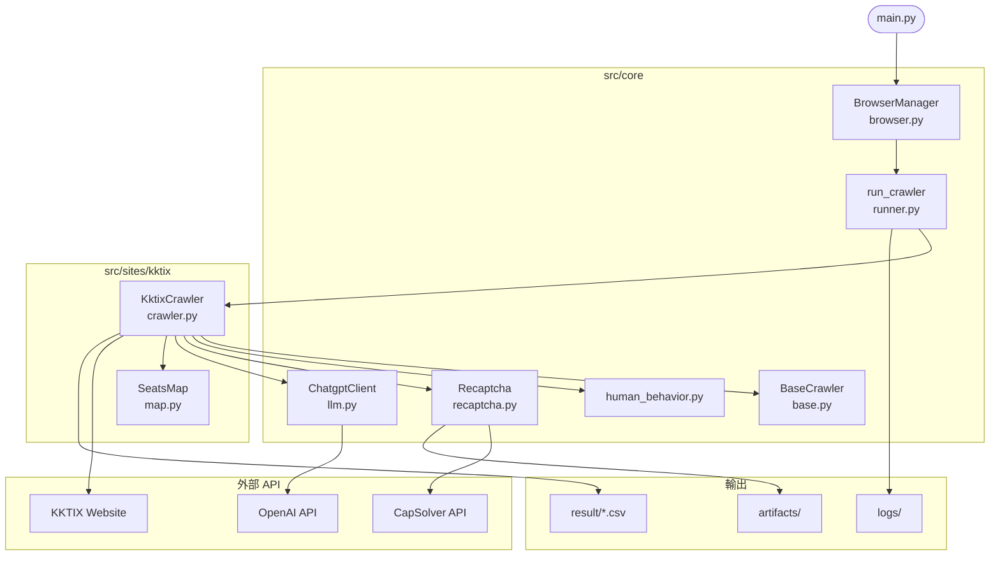
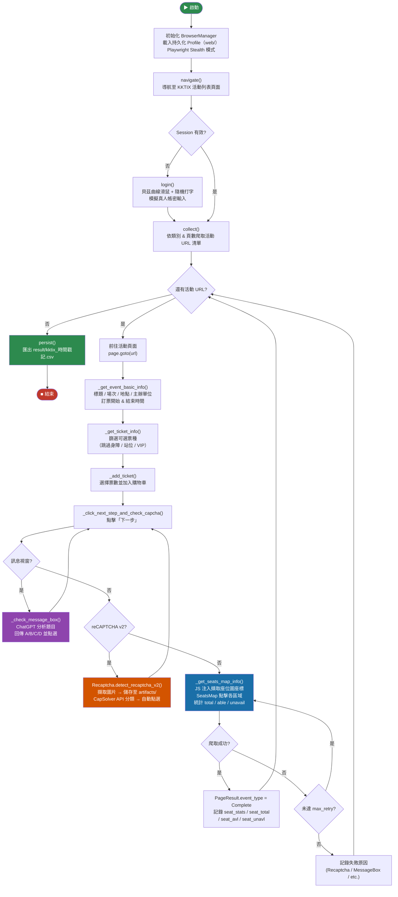

# KKTIX Crawler

一個以 **Playwright** 與 **Python 3.11** 打造的非同步網路爬蟲系統，用於自動化收集 [KKTIX](https://kktix.com) 的活動資訊與座位可用狀態。系統整合了反爬蟲偵測迴避、reCAPTCHA v2 自動解題（CapSolver）以及 ChatGPT 輔助回答驗證問題等能力。

---

## 目錄

- [專案概述](#專案概述)
- [系統架構](#系統架構)
- [專案結構](#專案結構)
- [環境需求](#環境需求)
- [安裝步驟](#安裝步驟)
- [設定說明](#設定說明)
- [API 費用說明](#api-費用說明)
- [執行爬蟲](#執行爬蟲)
- [輸出結果](#輸出結果)
- [活動類型分類](#活動類型分類)
- [部署](#部署)

---

## 專案概述

本專案針對 KKTIX 自動化執行以下流程：

1. **Navigate（導航）** — 以隨機延遲模擬真人操作，載入 KKTIX 活動列表頁面，並將瀏覽器 Session 持久化保存以維持登入狀態。
2. **Login（登入）** — 使用設定的帳號憑證進行驗證，以貝茲曲線模擬真實的滑鼠軌跡與隨機鍵盤輸入行為。
3. **Collect（收集）** — 依設定的活動類別爬取活動網址清單，並自動翻頁。
4. **Crawl（爬取）** — 針對每個活動：
   - 擷取後設資料（標題、場次、地點、主辦單位、訂票時間）
   - 選擇可購票種並進入劃位流程
   - 遭遇訊息視窗時，呼叫 **ChatGPT** 自動回答驗證題
   - 遭遇 reCAPTCHA v2 圖片挑戰時，呼叫 **CapSolver** API 自動解題
   - 收集各座位區域統計數據（可用 / 已售 / 總數）
5. **Persist（儲存）** — 將所有結果匯出至帶有時間戳記的 CSV 檔案。

---

## 系統架構

### 模組關係圖



---

### 爬蟲執行流程



---

### 主要設計決策

| 元件 | 說明 |
|---|---|
| `BrowserManager` | 管理單一持久性 Chromium Context（`web/` 目錄），以 Semaphore 控制並發數量，跨執行保留 cookies / localStorage |
| `BaseCrawler` | 定義抽象爬蟲介面（`navigate / login / collect / crawl / persist`），新增站點只需在 `src/sites/<name>/crawler.py` 繼承實作 |
| `runner.py` | 依站點名稱動態 import 爬蟲類別，透過 `asyncio.gather` 支援多站點並行 |
| `human_behavior.py` | 貝茲曲線滑鼠移動、隨機打字延遲（含錯誤修正模擬）、擬真捲動，集中管理供所有爬蟲共用 |
| `recaptcha.py` | 偵測 reCAPTCHA v2 anchor / bframe、擷取圖片並呼叫 CapSolver API 分類後自動點選 |
| `llm.py` | 呼叫 OpenAI API，以精簡 System Prompt 回答選擇題（單字母 A/B/C/D 或 UNKNOWN） |

---

## 專案結構

```
crawler_sys/
│
├── main.py                           # 非同步程式進入點
├── Dockerfile                        # 容器映像定義（python:3.11-slim + xvfb）
├── pyproject.toml                    # 專案依賴定義
├── uv.lock                           # 依賴鎖定檔
├── .python-version                   # Python 版本鎖定（3.11）
├── .gitignore
├── .env                              # 環境變數（帳號憑證 / API Keys，不納入版控）
│
├── src/
│   ├── config/
│   │   └── kktix.yaml                # KKTIX CSS 選擇器、模態框設定、JS 擷取腳本
│   │
│   ├── core/
│   │   ├── base.py                   # 抽象 BaseCrawler（定義爬蟲生命週期）
│   │   ├── browser.py                # BrowserManager（Playwright Stealth + 持久 Context）
│   │   ├── human_behavior.py         # 擬真滑鼠、鍵盤、捲動行為
│   │   ├── llm.py                    # ChatgptClient（OpenAI API 整合）
│   │   ├── recaptcha.py              # reCAPTCHA v2 偵測與 CapSolver 解題
│   │   └── runner.py                 # 動態爬蟲載入與執行器
│   │
│   ├── model/
│   │   ├── enums.py                  # ResultCode（活動分類）、ResultColumn 列舉
│   │   ├── llm.py                    # LLMConfig 設定資料類別
│   │   ├── metrics.py                # StepMetric / FailureMetric TypedDicts
│   │   └── page.py                   # PageResult 資料類別（爬蟲輸出格式）
│   │
│   ├── sites/
│   │   ├── utils.py                  # safe_text、parse_coords、centroid 輔助函式
│   │   ├── kktix/
│   │   │   ├── crawler.py            # KktixCrawler 實作
│   │   │   └── map.py                # SeatsMap（座位區域互動與資料擷取）
│   │   └── states/
│   │       └── kktix.json            # 持久化瀏覽器 Session 狀態（不納入版控）
│   │
│   └── utils/
│       ├── config_reader.py          # Singleton YAML / JSON 設定載入器
│       ├── env_loader.py             # 基於 Pydantic 的環境變數設定（singleton）
│       ├── jitter.py                 # 隨機延遲產生器
│       ├── logger_factory.py         # 帶 emoji 圖示的 Logger 工廠（終端機 + 檔案）
│       └── metrics.py                # CrawlMetrics（爬蟲計時與效能統計）
│
├── web/                              # Playwright 持久性瀏覽器 Profile（不納入版控）
├── artifacts/                        # CapSolver 擷取的 reCAPTCHA 挑戰圖片
├── logs/                             # 執行時期日誌
│   ├── system/                       # 系統層級日誌
│   └── crawler/kktix/                # KKTIX 爬蟲日誌
├── result/                           # CSV 輸出目錄
└── src/k8s-ml.yaml                   # Kubernetes 部署清單（AKS）
```

---

## 環境需求

- **Python** 3.11+
- **[uv](https://docs.astral.sh/uv/)** 套件管理工具（建議）或 pip
- **CapSolver** 帳號及 API Key（reCAPTCHA 自動解題）
- **OpenAI** API Key（訊息視窗自動回答）

---

## 安裝步驟

**1. 複製儲存庫**

```bash
git clone https://github.com/joechangFET/crawler_sys.git
cd crawler_sys
```

**2. 安裝相依套件（擇一）**

使用 uv（建議）：
```bash
uv sync
```

使用 pip：
```bash
python -m venv .venv
source .venv/bin/activate        # Linux / macOS
.venv\Scripts\activate           # Windows
pip install -e .
```

**3. 安裝 Playwright 瀏覽器**

```bash
playwright install chromium
```

---

## 設定說明

### 環境變數

在專案根目錄建立 `.env` 檔案：

```env
# 必填
LOG_LEVEL=INFO
KKTIX_USER=<your_kktix_username>
KKTIX_PASSWORD=<your_kktix_password>
CAPSOLVER_API=<your_capsolver_api_key>
CHATGPT_API_KEY=<your_openai_api_key>

# 選填（預設 true）
HEADLESS=false
```

| 變數 | 必填 | 說明 |
|---|---|---|
| `LOG_LEVEL` | 是 | 日誌等級（DEBUG / INFO / WARNING / ERROR） |
| `KKTIX_USER` | 是 | KKTIX 帳號（Email） |
| `KKTIX_PASSWORD` | 是 | KKTIX 密碼 |
| `CAPSOLVER_API` | 是 | [CapSolver](https://capsolver.com) API Key，用於 reCAPTCHA v2 自動解題 |
| `CHATGPT_API_KEY` | 是 | OpenAI API Key，用於訊息視窗選擇題自動回答 |
| `HEADLESS` | 否 | 瀏覽器無頭模式（預設 `true`；本機除錯建議設 `false`） |

> 以上值由 `src/utils/env_loader.py` 透過 Pydantic `BaseSettings` 於啟動時驗證，任一必填欄位缺失將導致程式立即終止。

### 站點設定（`src/config/kktix.yaml`）

| 鍵值 | 說明 |
|---|---|
| `setting.main_url` | KKTIX 活動列表頁面網址 |
| `setting.category` | 要爬取的活動類別清單（例如 `演唱會`） |
| `setting.page` | 翻頁爬取的頁數上限 |
| `setting.max_retry` | 每個座位區域發生錯誤時的最大重試次數 |
| `setting.persist_dir` | 瀏覽器 Profile 持久化目錄（預設 `./web`） |
| `contents.disable_keywords` | 用於識別無障礙座位並跳過的關鍵字清單 |
| `selectors.*` | 圖片地圖、氣泡、彈窗、座位表的 CSS 選擇器 |
| `modals.modal` | 需要關閉的模態框選擇器清單 |
| `modals.txt` | 關閉按鈕文字清單（知道了、關閉、× 等） |
| `captcha.patterns` | reCAPTCHA / hCaptcha 偵測關鍵字 |
| `js.extract` | 注入頁面以擷取圖片地圖座位區域坐標與重心的 JavaScript |

---

## API 費用說明

本系統使用兩個付費外部 API，費用依實際觸發次數計算，一般爬取情境下成本極低。

> 以下價格為撰寫時參考值，請以官方定價頁面為準：
> [CapSolver Pricing](https://www.capsolver.com/pricing) ／ [OpenAI Pricing](https://openai.com/api/pricing)

---

### CapSolver — reCAPTCHA v2 自動解題

**計費單位：每次成功解題（per task）**

| 題型 | 單價（約） | 說明 |
|---|---|---|
| reCAPTCHA v2 圖片挑戰 | $0.80 / 1,000 tasks | 本系統使用此類型 |
| reCAPTCHA v2 Enterprise | $1.20 / 1,000 tasks | 未使用 |

**觸發條件：** 爬蟲進入劃位頁面後，KKTIX 顯示 reCAPTCHA 圖片挑戰（`ResultCode.RECAPCHA`）時才會呼叫，並非每個活動都會觸發。

**費用範例：**

| 情境 | 爬取活動數 | 預估觸發次數 | 費用（約） |
|---|---|---|---|
| 一般爬取 | 100 | 15 次（15%） | $0.012 |
| 高頻爬取 | 1,000 | 150 次（15%） | $0.12 |
| 最壞情況 | 1,000 | 1,000 次（100%） | $0.80 |

---

### OpenAI API — 訊息視窗自動回答

**計費單位：Token 用量（輸入 + 輸出分開計費）**

使用模型：`gpt-4o-mini`（於 `src/model/llm.py` 設定）

| 費用類型 | 單價（約） |
|---|---|
| 輸入（Input tokens） | $0.15 / 1M tokens |
| 輸出（Output tokens） | $0.60 / 1M tokens |

**觸發條件：** KKTIX 顯示驗證訊息視窗（例如「請選擇正確答案」選擇題）時才會呼叫，每次呼叫 token 用量極小。

**單次呼叫估算：**

```
System Prompt  ≈  60 tokens（固定）
問題內容        ≈  80 tokens（選擇題文字）
回答            ≈   5 tokens（單字母 A/B/C/D）
─────────────────────────────
單次費用        ≈  (140 × $0.00000015) + (5 × $0.0000006)
               ≈  $0.000024（約 NT$0.0008）
```

**費用範例：**

| 情境 | 爬取活動數 | 預估觸發次數 | 費用（約） |
|---|---|---|---|
| 一般爬取 | 100 | 10 次（10%） | $0.00024 |
| 高頻爬取 | 1,000 | 100 次（10%） | $0.0024 |
| 最壞情況 | 1,000 | 1,000 次（100%） | $0.024 |

---

### 綜合費用試算

以 **爬取 1,000 個活動** 為例：

| API | 預估觸發 | 費用（USD） | 費用（NTD 約） |
|---|---|---|---|
| CapSolver（reCAPTCHA） | 150 次 | $0.12 | NT$4 |
| OpenAI（訊息視窗） | 100 次 | $0.003 | NT$0.1 |
| **合計** | | **$0.123** | **約 NT$4** |

> **建議：** CapSolver 最低儲值約 $5，OpenAI 建議設定 Usage Limit（於 [platform.openai.com](https://platform.openai.com/settings/organization/limits) 設定），避免異常呼叫造成意外費用。

---

## 執行爬蟲

於專案根目錄執行：

```bash
python main.py
```

執行流程：

1. 啟動 Chromium（依 `HEADLESS` 設定決定是否顯示視窗）。
2. 以 Stealth 模式載入持久化 Profile（`web/`），重用已保存的 Session。
3. 若尚未登入，自動以模擬真人行為執行登入。
4. 依 `kktix.yaml` 中設定的類別與頁數收集活動網址。
5. 針對每個活動依序執行：
   - 擷取基本資料（標題、場次、地點、主辦單位、訂票時間區間）
   - 選擇票種、進入劃位頁面
   - 若出現訊息視窗 → ChatGPT 回答並繼續
   - 若出現 reCAPTCHA → CapSolver 解題並繼續
   - 收集座位圖各區域統計
6. 將結果寫入 `result/kktix_<YYYYMMDD_HHMMSS>.csv`。

**日誌輸出位置：**

| 路徑 | 說明 |
|---|---|
| `logs/system/CrawlerSystem_<日期>.log` | 系統層級啟動日誌 |
| `logs/crawler/kktix/kktix_<日期>.log` | 各活動爬取詳細日誌 |

---

## 輸出結果

輸出 CSV 中每一列對應一個已爬取的活動，欄位定義於 `src/model/page.py`：

| 欄位 | 型別 | 說明 |
|---|---|---|
| `url` | `str` | 活動頁面網址 |
| `title` | `str` | 活動標題 |
| `schedule` | `str` | 活動日期／時間 |
| `location` | `str` | 活動地點 |
| `organizer` | `str` | 主辦單位 |
| `booking_start_time` | `str` | 開放訂票時間 |
| `booking_end_time` | `str` | 結束訂票時間 |
| `event_type` | `str` | 活動分類結果（詳見下方說明） |
| `tickets` | `list[dict]` | 所有票種資訊（名稱、座位、價格、是否售完） |
| `seat_stats` | `list[dict]` | 各區域座位計數（total / able / not_able / already / unknown） |
| `seat_total` | `int` | 座位總數 |
| `seat_avl` | `int` | 可用座位總數 |
| `seat_unavl` | `int` | 已售出座位總數 |
| `elapsed_time` | `float` | 處理該活動所耗費的秒數 |

---

## 活動類型分類

每個活動依票券與頁面特徵被賦予一個 `ResultCode`：

| 代碼 | 中文說明 | 說明 |
|---|---|---|
| `Normal` | 無法選位 | 一般活動；無座位圖或不適用 |
| `Computer` | 電腦自動選位 | 系統自動分配座位，無法手動選擇 |
| `VIP` | VIP 座位 | VIP 專屬座位區 |
| `DISABLE` | 身障座位 | 無障礙／身心障礙專屬座位 |
| `STANDING` | 站位 | 站席票種 |
| `MESSAGEBOX` | 反爬蟲驗證-訊息視窗 | 進入劃位前出現自訂驗證對話框（ChatGPT 自動回答） |
| `RECAPCHA` | 反爬蟲驗證-圖片驗證 | 偵測到 Google reCAPTCHA v2（CapSolver 自動解題） |
| `Complete` | 完整爬取 | 成功收集完整座位圖統計資料 |

---

## 部署

### Docker

建置並執行容器映像（需先準備 `.env` 或環境變數）：

```bash
docker build -t kktix-crawler .
docker run --rm --env-file .env kktix-crawler
```

`Dockerfile` 基於 `python:3.11-slim`，安裝 `xvfb` 以在無頭伺服器環境中提供虛擬顯示。

### Kubernetes（AKS）

`src/k8s-ml.yaml` 將單一副本部署至 Azure Kubernetes Service 的 `ml` 命名空間：

```bash
kubectl apply -f src/k8s-ml.yaml
```

映像從 Azure Container Registry 拉取：

```
fetbdcrawacrprod.azurecr.io/kktix_crawler_poc:{IMAGE_TAG}
```

資源配置：

| 類型 | CPU | Memory |
|---|---|---|
| requests | 250m | 512Mi |
| limits | 500m | 1Gi |

Secret 透過 Kubernetes Secret `kktix-crawler-secrets` 注入（包含 `.env` 中所有必填變數）。
